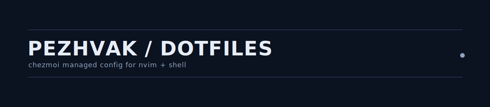

# Pezhvak Dotfiles



> Personal dotfiles managed with `chezmoi`, tuned for a fast, modular, nerd-font-powered terminal/Neovim workflow.

## Why this repo exists

I want my terminal and editor to feel like a spaceship cockpit, not a text box.
This repo tracks my daily-driver setup in a reproducible way so I can bootstrap a new machine quickly and keep everything versioned.

## What is inside

- `chezmoi`-managed source tree (`dot_*` files map to real dotfiles on apply)
- Zsh shell config split across `.zshenv` / `.zprofile` / `.zshrc` (see [Shell layout](#shell-layout))
- A modular Neovim config under `dot_config/nvim/` (plugins via `lazy.nvim`)
- Tmux config under `dot_config/tmux/`
- Nerd Font-first experience (Powerlevel10k prompt, `vim.g.have_nerd_font = true`)

## Repo map

```text
.
├── dot_zshenv              # env vars, brew, consolidated PATH (all zsh shells)
├── empty_dot_zprofile      # intentionally empty (PATH lives in .zshenv)
├── dot_zshrc               # interactive: p10k, omz, plugins, tool init
├── dot_config/
│   ├── nvim/               # Neovim config (lazy.nvim, Mason, plugins)
│   └── tmux/tmux.conf
├── assets/                 # banner.svg etc.
├── AGENTS.md               # notes for AI agents working in this repo
└── README.md
```

## Shell layout

| Source                | Home target   | Loaded for         | Purpose                                                          |
| --------------------- | ------------- | ------------------ | ---------------------------------------------------------------- |
| `dot_zshenv`          | `~/.zshenv`   | every zsh shell    | env vars, `brew shellenv`, single `typeset -U` PATH array        |
| `empty_dot_zprofile`  | `~/.zprofile` | login shells       | empty — PATH lives in `.zshenv` so non-login shells also work    |
| `dot_zshrc`           | `~/.zshrc`    | interactive shells | p10k instant prompt, oh-my-zsh, nvm/pyenv/bun init, sources local|

### Private overrides — `~/.zshrc.local`

`~/.zshrc.local` is **not tracked**. `dot_zshrc` sources it at the end if present. Use it for anything machine-specific or sensitive:

- Host-specific aliases (SSH bookmarks)
- Tool paths that don't exist on every machine (e.g. IDA Pro)
- Anything that would leak infra/identity info in a public repo

Example:

```sh
alias ssh:prod='ssh root@example.com'
alias ida='sudo /Applications/IDA\ Professional.app/Contents/MacOS/ida'
```

## Bootstrap on a new machine

```bash
# 1) Install chezmoi (pick your platform/package manager)
# 2) Initialize from this repo (SSH)
chezmoi init git@github.com:pezhvak/dotfiles.git

# If SSH is not set up yet, use HTTPS
chezmoi init https://github.com/pezhvak/dotfiles.git

# 3) Preview changes safely
chezmoi diff

# 4) Apply
chezmoi apply
```

Post-apply: create `~/.zshrc.local` for any private aliases or host-specific paths.

## Neovim dev loop

Run these from `dot_config/nvim/`:

```bash
stylua --check .
stylua .
```

Inside Neovim:

- `:Lazy sync` to sync plugins
- `:checkhealth pezhvak` to sanity-check runtime dependencies

## Core philosophy

- Keep modules small and focused
- Prefer fast defaults and discoverable keymaps
- Treat config like code: readable, testable, versioned
- Ship improvements continuously, not in giant rewrites

## License

MIT (or: do-whatever-you-want-if-you-learn-something-cool).
